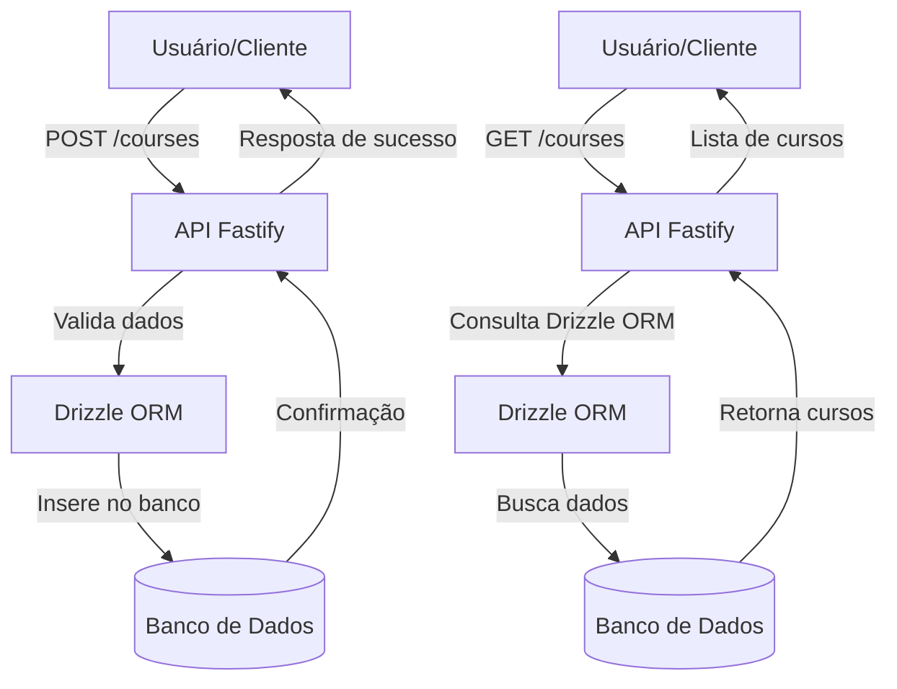

# API Node.js com Fastify, Drizzle ORM e Docker

Este projeto é uma API desenvolvida em Node.js utilizando Fastify, Drizzle ORM para manipulação de banco de dados e Docker para facilitar o ambiente de desenvolvimento.

## Tecnologias Utilizadas

- **Node.js**
- **Fastify**
- **Drizzle ORM**
- **Docker & Docker Compose**
- **TypeScript**

## Estrutura do Projeto

```
├── docker-compose.yml         # Configuração dos containers Docker
├── drizzle.config.ts          # Configuração do Drizzle ORM
├── package.json               # Dependências e scripts do projeto
├── server.ts                  # Arquivo principal do servidor
├── src/
│   ├── database/
│   │   ├── client.ts          # Conexão com o banco de dados
│   │   └── schema.ts          # Definição dos esquemas do banco
│   └── routes/
│       ├── create-course.ts   # Rota para criar curso
│       ├── get-courses.ts     # Rota para listar cursos
│       └── get-courses-by-id.ts # Rota para buscar curso por ID
└── drizzle/                   # Migrações do banco de dados
```

## Como rodar o projeto

1. **Clone o repositório:**
   ```bash
   git clone <url-do-repositorio>
   cd ApiNodeJS
   ```

2. **Instale as dependências:**
   ```bash
   npm install
   ```

3. **Suba os containers com Docker Compose:**
   ```bash
   docker compose up -d
   ```

4. **Execute as migrações do banco de dados:**
   ```bash
   # Comando exemplo, ajuste conforme sua configuração do Drizzle
   npx drizzle-kit migrate:latest
   ```

5. **Inicie a aplicação:**
   ```bash
   npm run dev
   ```

## Endpoints principais

- `POST /courses` — Cria um novo curso
- `GET /courses` — Lista todos os cursos
- `GET /courses/:id` — Busca um curso pelo ID

## Observações

- Certifique-se de que o Docker esteja instalado e rodando em sua máquina.
- As configurações do banco de dados podem ser ajustadas no arquivo `docker-compose.yml` e nos arquivos de configuração do Drizzle.

## Licença

Este projeto está sob a licença MIT.


## Documentação da API

Este projeto utiliza o pacote [`@scalar/fastify-api-reference`](https://github.com/scalar/scalar) para gerar documentação automática e interativa dos endpoints da API.


## Fluxo Principal da Aplicação

O diagrama abaixo ilustra o fluxo mais importante da aplicação: criação e consulta de cursos.



### Como acessar a documentação

1. Certifique-se de que o servidor está rodando (`npm run dev`).
2. Acesse o endereço: `http://localhost:PORT/docs` no navegador (substitua `PORT` pela porta configurada no seu servidor, geralmente 3000).

### Como configurar (caso queira personalizar)

No arquivo principal do servidor (ex: `server.ts`), adicione:

```ts
import { fastifyAPIReference } from '@scalar/fastify-api-reference';

fastify.register(fastifyAPIReference, {
   routePrefix: '/docs',
   // outras opções de configuração
});
```

Assim, você terá uma interface interativa para explorar e testar os endpoints da API, facilitando o desenvolvimento e a integração.
